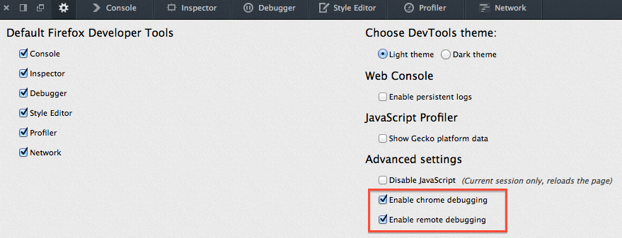

# Setting up a development profile

You can have various [Firefox profiles](https://developer.mozilla.org/en-US/Firefox/Multiple_profiles) (think of something like "user accounts"), each one with different settings, addons, appearance, etc.

This page will guide you through configuring a new profile to enable development features such as additional logging, dumping of network packets, remote debugging, etc. which will help when working in DevTools.

Many of these changes are achieved by modifying preferences in `about:config`, a special page you can access by entering that in Firefox's URL bar. The first time, it will show you a warning page. Click through and then you can start searching for preferences to modify.

Here's [a support article](https://support.mozilla.org/t5/Manage-preferences-and-add-ons/Configuration-Editor-for-Firefox/ta-p/35030) if you need help.

## Create a permanent profile

We were using a temporary profile in the previous step, [building DevTools](./build.md). The contents of this profile are deleted each time the browser is closed, which means any preferences we set will not persist.

The solution is to create a new profile:

```
./mach run -P development
```

If this profile doesn't exist yet (quite likely), a window will open offering you options to create a new profile, and asking you which name you want to use. Create a new one, and name it `development`. Then start Firefox by clicking on `Start Nightly`.

Next time you start Firefox with `./mach run -P development`, the new profile will be automatically used, and settings will persist between browser launches.

## Enable additional logging

You can change the value of these preferences by going to `about:config`:

| Preference name | Value | Comments |
| --------------- | --------------- | -------- |
| `browser.dom.window.dump.enabled` | `true` | Adds global `dump` function to log strings to `stdout` |
| `devtools.debugger.log` (*) | `true` | Dump packets sent over remote debugging protocol to `stdout`.<br /><br />The [remote protocol inspector add-on](https://github.com/firebug/rdp-inspector/wiki) might be useful too. |
| `devtools.dump.emit` (*) | `true` | Log event notifications from the EventEmitter class<br />(found at `devtools/shared/event-emitter.js`). |

Preferences marked with a (`*`) also require `browser.dom.window.dump.enabled` in order to work. You might not want to enable *all* of those all the time, as they can cause the output to be way too verbose, but they might be useful if you're working on a server actor, for example<!--TODO link to actors doc-->.

Restart the browser to apply configuration changes.

## Enable remote debugging and the Browser Toolbox

These settings allow you to use the [browser toolbox](https://developer.mozilla.org/docs/Tools/Browser_Toolbox) to inspect the DevTools themselves, set breakpoints inside of DevTools code, and run the [Scratchpad](https://developer.mozilla.org/en-US/docs/Tools/Scratchpad) in the *Browser* environment.

Open DevTools, and click the "Toolbox Options" gear icon in the top right (the image underneath is outdated). <!--TODO update image-->

Make sure the following two options are checked:

- Enable browser chrome and add-on debugging toolboxes
- Enable remote debugging



In `about:config`, set `devtools.debugger.prompt-connection` to `false`.

This will get rid of the prompt displayed every time you open the browser toolbox.

## Enable DevTools assertions

When assertions are enabled, assertion failures are fatal, log console warnings, and throw errors.

When assertions are not enabled, the `assert` function is a no-op.

It also enables the "debug" builds of certain third party libraries, such as React.

To enable assertions, add this to your `.mozconfig`:

```
ac_add_options --enable-debug-js-modules
```

And assert your own invariants like this:

```
const { assert } = require("devtools/shared/DevToolsUtils");
// ...
assert(1 + 1 === 2, "I really hope this is true...");
```


